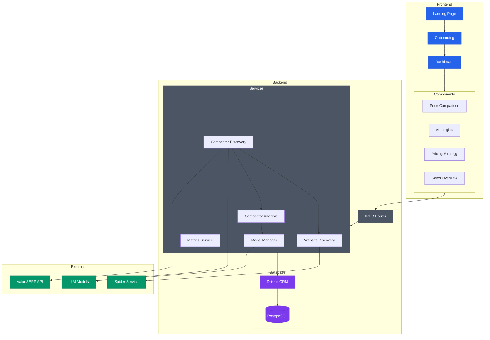

```mermaid
graph TB
    subgraph Frontend
        LP[Landing Page]
        OB[Onboarding]
        DB[Dashboard]
        subgraph Components
            PC[Price Comparison]
            AI[AI Insights]
            PS[Pricing Strategy]
            SO[Sales Overview]
        end
    end

    subgraph Backend
        TR[tRPC Router]
        subgraph Services
            MA[Model Manager]
            MS[Metrics Service]
            WD[Website Discovery]
            CA[Competitor Analysis]
            CD[Competitor Discovery]
        end
        
        subgraph Database
            DZ[Drizzle ORM]
            PG[(PostgreSQL)]
        end
    end

    subgraph External
        LLM[LLM Models]
        SP[Spider Service]
        VS[ValueSERP API]
    end

    %% Frontend connections
    LP --> OB
    OB --> DB
    DB --> Components
    Components --> TR

    %% Backend connections
    TR --> Services
    Services --> DZ
    DZ --> PG
    
    %% External service connections
    MA --> LLM
    WD --> SP
    CD --> VS
    CD --> LLM

    %% Service interactions
    CA --> MA
    CD --> CA
    CD --> WD

    classDef primary fill:#2563eb,stroke:#1d4ed8,color:#fff
    classDef secondary fill:#4b5563,stroke:#374151,color:#fff
    classDef external fill:#059669,stroke:#047857,color:#fff
    classDef database fill:#7c3aed,stroke:#6d28d9,color:#fff

    class LP,OB,DB primary
    class TR,Services secondary
    class LLM,SP,VS external
    class DZ,PG database
```
